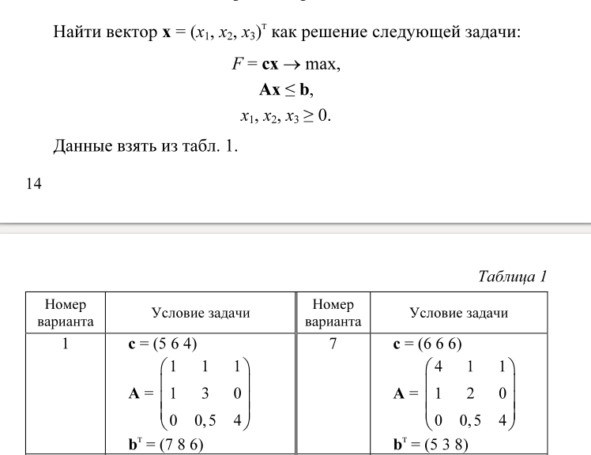

# ЛР1 по Методам Оптимизации. Линейное программирование. Симплекс-метод.

### Выполнил:
Cтудент группы ИУ8-34 Александров Алексей.

### Цель работы: 
изучить постановку задачи ЛП; овладеть навыками решения
задач ЛП с помощью симплекс-метода.

### Постановка задачи в общем виде.
#### Вариант 1.

