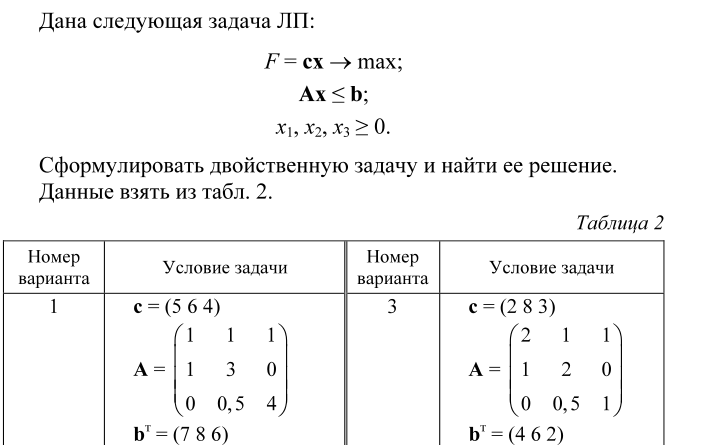

# ЛР2 по Методам Оптимизации. Двойственность в линейном программировании.

### Выполнил:
Cтудент группы ИУ8-34 Александров Алексей.

### Цель работы: 
**Изучить постановку двойственной задачи (ДЗ);
ЛП по прямой задаче (ПЗ); получить навыки решения соответствующей
ДЗ по прямой задаче.**

### Постановка задачи в общем виде.
#### Вариант 1.

